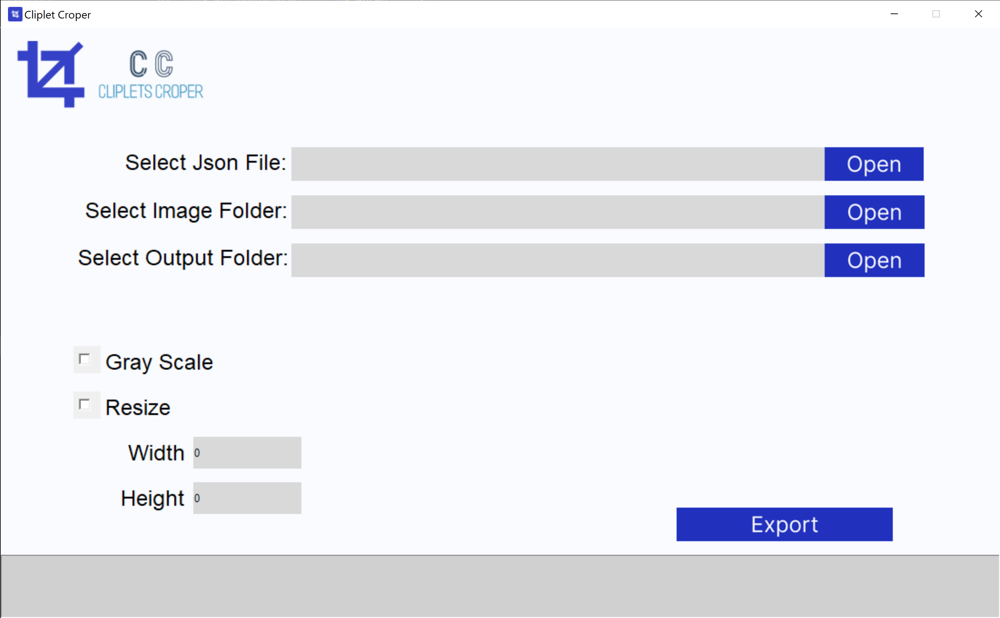

# Cliplets Cropper


The tool allows you to cut cliplets containing a single character from the annotations JSON file and from the original images of the documents.


#
To use the tool, you nees simply to follow the guide.

The tool requres:
- python 3.8
- Pillow

You can create a new conda enviroment running the command:
```console
conda env create -f environment.yml
```
and activate it using:
```console
conda activate clipletscropper
```

To run the python script, you can use the command:
```console
python src/gui.py
```


Alternatively, you can download the Windows executable file from the `build` folder:

- [ClipletsCropper.exe](build/ClipletsCropper.exe)


#
Once your enviroment is ready, to use the tool you need to:
1) select the JSON file
2) Select the folder that contains all the original images of the entire documents
3) Select a desired output folder

Additionaly you can:
- Select the "Grayscale" option. Wen this option is activated, all cliplet are converted in grayscale images.
- Select the "Resize" option. Selecting this option all the cliplet images are resized to the given new dimension. If only one between height and width are provided, the tool resizes the cliplets keeping the original ratio.


